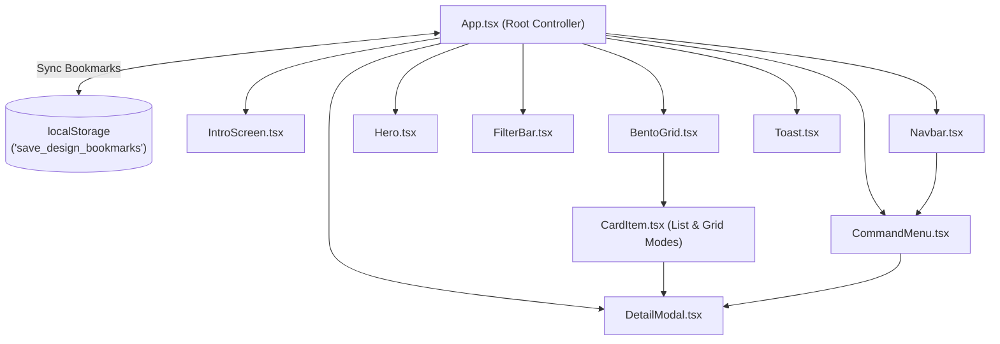

# STACKSIGHT — Award-Winning Website Tech Stack & Palette Inspector

[](https://react.dev/)
[](https://www.typescriptlang.org/)
[](https://vite.dev/)
[](https://tailwindcss.com/)
[](https://gsap.com/)
[](https://motion.dev/)
[](https://oxc.rs/)

> **STACKSIGHT** is an elite web architecture directory and color palette inspection engine. It allows developers, UI/UX designers, and creative technologists to dissect production tech stacks, extract 1-click hex palettes, examine verified performance metrics, and bookmark award-winning digital experiences.

---

## 📑 Table of Contents

- [Overview & Vision](#-overview--vision)
- [Tech Stack & Dependencies](#-tech-stack--dependencies)
- [Key Features](#-key-features)
- [Directory Structure](#-directory-structure)
- [Setup & Quickstart](#-setup--quickstart)
- [Architecture Summary](#-architecture-summary)
- [Conventional Commits Guidelines](#-conventional-commits-guidelines)
- [License](#-license)

---

## 🔭 Overview & Vision

Modern web development moves at breakneck speeds. Cutting-edge digital agencies and product studios continuously launch websites featuring complex GLSL shaders, 3D WebGL physics simulations, and micro-interactions. However, inspecting the exact libraries, CSS tokens, and performance metrics typically requires manual source-code digging, DevTools inspection, or browser extension overhead.

**STACKSIGHT** solves this problem by delivering a unified, dark OLED directory engineered for immediate discovery:

- **Full Architectural Transparency**: Reveals verified frontend frameworks ([React](https://react.dev/), [Next.js](https://nextjs.org/), [Svelte](https://svelte.dev/)), motion engines ([GSAP](https://gsap.com/), [Framer Motion](https://motion.dev/)), 3D pipelines ([Three.js](https://threejs.org/), [WebGL](https://www.khronos.org/webgl/)), and CSS systems ([Tailwind CSS](https://tailwindcss.com/), [Shadcn UI](https://ui.shadcn.com/)).
- **Chromatic Extraction**: Generates instant, 5-swatch color profiles (`Primary`, `Secondary`, `Accent`, `Surface`, `Background`) with one-click hex copying.
- **Engineering Telemetry**: Displays key performance benchmarks such as Lighthouse scores, shader FPS targets, DOM node counts, and bundle sizes.
- **Zero-Latency Portability**: Ships as a modern React single-page app and compiles down to an entirely standalone, zero-external-dependency offline single-file bundle (`dist/index.html` / `stacksight.html`).

---

## 🛠 Tech Stack & Dependencies

| Category | Package / Tool | Version | Purpose & Architectural Role |
| :--- | :--- | :--- | :--- |
| **Core Framework** | [`react`](file:///c:/Users/user/Downloads/demo%20saas/package.json#L19) | `^19.2.8` | Component rendering, concurrent scheduling, and unidirectional UI state |
| **Runtime & DOM** | [`react-dom`](file:///c:/Users/user/Downloads/demo%20saas/package.json#L20) | `^19.2.8` | React DOM bindings with modern StrictMode mounting |
| **Language** | [`typescript`](file:///c:/Users/user/Downloads/demo%20saas/package.json#L30) | `~6.0.2` | Strict compile-time typing, design schema validation, and IDE autocompletion |
| **Build Engine** | [`vite`](file:///c:/Users/user/Downloads/demo%20saas/package.json#L31) | `^8.2.2` | Sub-millisecond Hot Module Replacement (HMR) and optimized Rollup production builds |
| **CSS Engine** | [`tailwindcss`](file:///c:/Users/user/Downloads/demo%20saas/package.json#L22) | `^4.3.3` | Next-generation Tailwind CSS engine with native Vite compiler integration |
| **Vite Tailwind Plugin** | [`@tailwindcss/vite`](file:///c:/Users/user/Downloads/demo%20saas/package.json#L14) | `^4.3.3` | High-speed CSS AST transformer without legacy `postcss.config.js` |
| **Physics Animation** | [`framer-motion`](file:///c:/Users/user/Downloads/demo%20saas/package.json#L16) | `^13.1.1` | Spring-physics drawer animations, pop-layout grid transitions, and AnimatePresence |
| **Timeline Motion** | [`gsap`](file:///c:/Users/user/Downloads/demo%20saas/package.json#L17) | `^3.15.0` | High-precision 60fps hero staggered reveals and coordinate transforms |
| **GSAP React Hook** | [`@gsap/react`](file:///c:/Users/user/Downloads/demo%20saas/package.json#L13) | `^2.1.2` | Safe animation lifecycle management with automatic scope cleanup (`gsap.context()`) |
| **Single-File Bundler** | [`vite-plugin-singlefile`](file:///c:/Users/user/Downloads/demo%20saas/package.json#L32) | `^2.3.3` | Inlines all scripts, stylesheets, and embedded assets into a portable single HTML file |
| **Iconography** | [`lucide-react`](file:///c:/Users/user/Downloads/demo%20saas/package.json#L18) | `^1.38.0` | Accessible, tree-shakeable SVG icons for navigation, filters, and UI controls |
| **Class Utilities** | [`clsx`](file:///c:/Users/user/Downloads/demo%20saas/package.json#L15), [`tailwind-merge`](file:///c:/Users/user/Downloads/demo%20saas/package.json#L21) | `^2.1.1`, `^3.6.0` | Conditional class merging and conflict resolution |
| **Linter** | [`oxlint`](file:///c:/Users/user/Downloads/demo%20saas/package.json#L29) | `^1.79.0` | Rust-based high-performance static analysis and lint engine |

---

## ✨ Key Features

### 1. 🍱 Bento Grid Layout Engine
- Displays curated designs in an adaptive responsive grid (`auto-rows-[340px]`).
- Supports dynamic card spans (`normal`, `tall`, `wide`) via [`layoutSpan`](file:///c:/Users/user/Downloads/demo%20saas/src/types/design.ts#L69).
- Styled with custom double-bezel borders (`.bezel-outer` and `.bezel-inner`) to create tactile physical depth.
- Fluidly transitions between multi-column bento grid and single-column dense list mode.

### 2. 🎨 1-Click Hex Palette Extractor
- Every design entry features an extracted 5-swatch color palette with classified roles (`Primary`, `Secondary`, `Accent`, `Surface`, `Background`).
- Clicking any swatch triggers `navigator.clipboard.writeText`, changes the icon to a verified checkmark, and triggers an animated feedback toast.

### 3. 🔍 Multi-Facet Tech Stack Explorer
- Real-time search across title, subtitle, domain, and specific tech stack terms.
- Filter chips for popular technologies (`Next.js`, `GSAP`, `WebGL`, `Tailwind CSS`, `React`, etc.).
- Dropdown selectors for Category (`SaaS`, `Portfolio`, `E-Commerce`, `Agency`, `Editorial`, `AI / Tech`, `Mobile App`) and Visual Style (`Minimalist`, `Dark Tech`, `Glassmorphism`, `Industrial Brutalism`, `3D / Interactive`, etc.).
- Multi-mode sorting by **Trending** (likes), **Latest** (publication date), or **Saved** (bookmarked first).

### 4. ⚡ Global `Cmd+K` / `Ctrl+K` Command Palette
- Accessible from anywhere in the application via standard keyboard shortcut (`Cmd+K` on macOS, `Ctrl+K` on Windows/Linux) or the floating search button.
- Instant search filter with live thumbnail previews.
- Complete keyboard accessibility: navigate with `↑` / `↓` arrow keys, activate with `Enter`, and dismiss with `Esc`.
- Quick-filter shortcuts to instantly scope the catalog to specific technologies.

### 5. 💾 LocalStorage Bookmark Persistence
- Save any design to a persistent personal collection with a single click on the bookmark icon.
- Automatically synchronizes to browser storage under the key `save_design_bookmarks`.
- Dedicated filter toggle in the header to view saved bookmarks alongside a reactive count badge.
- Resilient JSON serialization with fallback seeds (`kinetic-studio`, `vortex-engine`).

### 6. 🗂 Animated Detail Inspection Drawer
- Slide-over inspection drawer powered by spring physics (`framer-motion`).
- High-resolution preview image container with gallery thumbnail selector.
- Complete engineering specs: verified Lighthouse scores, FPS render rates, bundle sizes, and network latency.
- Direct external link to the live production site and one-click shareable URL generation (`?design=<id>`).

### 7. 🎬 Cinematic Intro Splash Screen
- Staggered letter-by-letter kinetic text reveal using Framer Motion variants.
- Deep OLED mesh gradient background with custom SVG turbulence and displacement filter (`#glass-effect`).
- Seamless transition to the catalog or instant trigger of the command palette.
- Replayable at any time via the "Intro" pill in the floating navbar.

---

## 📁 Directory Structure

```text
demo saas/
├── .oxlintrc.json                 # Oxlint static analysis rules
├── index.html                     # HTML5 entrypoint with Google Fonts preconnect
├── package.json                   # Project metadata, scripts, and dependencies
├── tsconfig.json                  # Root TypeScript configuration
├── tsconfig.app.json              # Application TypeScript compiler options
├── tsconfig.node.json             # Vite config TypeScript compiler options
├── vite.config.ts                 # Vite bundler configuration with singlefile plugin
├── stacksight.html                # Pre-built portable offline single-file distribution
├── dist/                          # Production build output
│   └── index.html                 # Self-contained bundled single-file application
└── src/
    ├── main.tsx                   # React root mount point with StrictMode
    ├── App.tsx                    # Root orchestrator: state, global hotkeys, filtering
    ├── App.css                    # Supplementary legacy styling
    ├── index.css                  # Core Tailwind CSS v4, fonts, and double-bezel classes
    ├── components/
    │   ├── BentoGrid.tsx          # Adaptive bento layout & list view renderer
    │   ├── CardItem.tsx           # Double-bezel card with hover preview and swatches
    │   ├── CommandMenu.tsx        # Cmd+K search modal with keyboard navigation
    │   ├── DetailModal.tsx        # Slide-over engineering drawer & color extractor
    │   ├── FilterBar.tsx          # Sticky category tabs, dropdowns, and counter
    │   ├── Hero.tsx               # GSAP staggered headline, search input, tech pills
    │   ├── IntroScreen.tsx        # Kinetic splash screen with SVG displacement
    │   ├── Navbar.tsx             # Floating glass header, command trigger, view toggle
    │   └── Toast.tsx              # Ephemeral bottom-right feedback alert
    ├── data/
    │   ├── imageBase64.ts         # Embedded base64 images for offline single-file bundles
    │   └── mockDesigns.ts         # Curated catalog entries, color palettes, metrics
    └── types/
        └── design.ts              # TypeScript schemas (DesignItem, FilterState, etc.)
```

---

## 🚀 Setup & Quickstart

### Prerequisites

- [Node.js](https://nodejs.org/) version **20.19.0** or higher
- [npm](https://www.npmjs.com/) version **10.0.0** or higher (or `pnpm` / `yarn`)

### 1. Clone & Install Dependencies

```bash
# Navigate to the project root
cd "c:\Users\user\Downloads\demo saas"

# Install production and development dependencies
npm install
```

### 2. Launch Local Development Server

```bash
npm run dev
```

The Vite development server will start with Hot Module Replacement (HMR):
```text
  VITE v8.2.2  ready in 180 ms

  ➜  Local:   http://localhost:5173/
  ➜  Network: use --host to expose
  ➜  press h + enter to show help
```

Open [http://localhost:5173](http://localhost:5173) in your browser to inspect the application.

### 3. Build for Production

```bash
npm run build
```

This script executes the TypeScript project references check (`tsc -b`) followed by the Vite production build (`vite build`).

> [!NOTE]
> Thanks to `vite-plugin-singlefile`, all JavaScript, CSS, and base64 assets are compiled directly into a single portable HTML file at `dist/index.html` (~3.6 MB). This file can be opened directly from disk without requiring a web server.

### 4. Preview the Production Build

```bash
npm run preview
```

Spins up a local static server to test the generated production bundle at [http://localhost:4173](http://localhost:4173).

### 5. Run Linter

```bash
npm run lint
```

Runs [Oxlint](https://oxc.rs/) across all TypeScript and React source files.

---

## 🏛 Architecture Summary



- **Unidirectional Data Flow**: State resides in [`App.tsx`](file:///c:/Users/user/Downloads/demo%20saas/src/App.tsx#L15-L40) and is passed downstream via typed props.
- **Synchronous Memoized Filtering**: Filtering, multi-term searching, and sorting run through an optimized `useMemo` block with zero rendering lag.
- **Dual Animation Layer**: GSAP drives precision element stagger timelines in the hero section, while Framer Motion handles dynamic React component unmounting and spring physics.

For the exhaustive architectural specification, see [ARCHITECTURE.md](file:///c:/Users/user/Downloads/demo%20saas/ARCHITECTURE.md).

---

## 📝 Conventional Commits Guidelines

STACKSIGHT strictly enforces the [Conventional Commits](https://www.conventionalcommits.org/en/v1.0.0/) specification for all git commit messages. This ensures readable git history, automated semantic versioning, and changelog generation.

### Commit Format

```text
<type>(<scope>): <short summary>

[optional body]

[optional footer(s)]
```

### Commit Types

| Type | Description | Example |
| :--- | :--- | :--- |
| `feat` | A new user-facing feature or capability | `feat(modal): add 1-click share URL copying` |
| `fix` | A bug fix in existing behavior | `fix(cmd-k): prevent arrow key default scroll behavior` |
| `docs` | Documentation changes only | `docs(readme): add quickstart and architecture guide` |
| `style` | Formatting, whitespace, semicolon changes (no code changes) | `style(cards): format double bezel classnames` |
| `refactor` | Code refactoring without changing user-facing behavior | `refactor(filter): extract search predicate into memo hook` |
| `perf` | Code changes that improve performance | `perf(grid): optimize image fallback SVG memoization` |
| `test` | Adding or correcting automated tests | `test(storage): add unit tests for bookmark persistence` |
| `chore` | Build process, auxiliary tools, package updates | `chore(deps): update tailwindcss to v4.3.3` |
| `ci` | CI configuration and script updates | `ci(github): add automated oxlint and build workflow` |

### Allowed Scopes

- `bento-grid`, `card`, `command-menu`, `detail-modal`, `filter`, `hero`, `intro`, `nav`, `toast`, `data`, `types`, `styles`, `bundle`.

### Example Commits

```bash
git commit -m "feat(filter): add visual style and tech stack multi-selection"
git commit -m "fix(command-menu): focus search input on modal open transition"
git commit -m "perf(bundle): inline optimized base64 SVG preview fallbacks"
git commit -m "docs(architecture): document double-bezel CSS utility structure"
```

---

## 📄 License

Internal SaaS Demonstration Project · Built with React 19, Vite 8, and Tailwind CSS v4.
